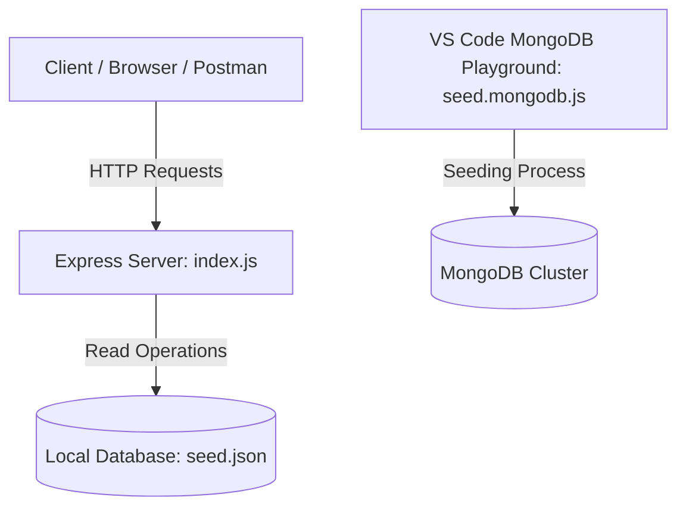

# Project Architecture & Directory Structure

This document describes the directory layout and architectural overview of the **NB6007CEM S2 Express API** project.

---

## 📁 Directory Structure

Below is the directory tree of the workspace with a short explanation of each file and folder:

```text
WebAPI/
├── .gitignore               # Instructs Git to ignore local files/folders like node_modules/
├── Readme.md                # Main API Documentation & Beginner's Setup Guide
├── architecture.md          # Architectural and folder structure documentation (this file)
├── index.js                 # Express.js entry point containing route definitions & server listener
├── package.json             # Project manifest defining metadata, startup scripts, and dependencies
├── package-lock.json        # Auto-generated lockfile recording exact installed dependency versions
├── postman_collection.json  # Pre-configured Postman tests to verify API endpoints locally
├── seed.json                # Local JSON database containing raw data for provinces, pings, etc.
├── seed.mongodb.js          # MongoDB Playground script to push seed.json data to a MongoDB cluster
├── server.log               # Log file containing runtime output of the server
└── node_modules/            # Folder containing all external packages (like Express) installed via npm
```

---

## 🏗️ Architectural Overview

This project is a lightweight backend REST API that follows a **Single-Entry Point** model. Below are the key design choices:



### 1. Framework: Express.js
The application is built on **Express.js**, a minimal and flexible Node.js web application framework. It provides a robust set of features for web applications and APIs, handling HTTP request routing dynamically.

### 2. Server Entrypoint: `index.js`
The file [index.js](file:///Users/shane/Documents/Pdf's/WEB-API/WEBAPI/WebAPI/index.js) is the core of the application:
- **Server Instance:** Initializes Express, binds the server to a specific port (defaulting to `3000`), and begins listening for incoming HTTP connections.
- **Routing Engine:** Maps paths (e.g., `/provinces`, `/vehicles/:vehicleId/pings`) to their respective handlers.
- **Controller Logic:** Contains the business logic to parse request params, filter data, and return proper HTTP response headers and JSON payloads.

### 3. Data Layer
Currently, the application operates in two modes:
1. **Mock Data (In-Memory):** Reads directly from [seed.json](file:///Users/shane/Documents/Pdf's/WEB-API/WEBAPI/WebAPI/seed.json) via `require("./seed.json")`. This structure ensures the application starts instantly without external database dependencies.
2. **MongoDB Production Migration:** By running [seed.mongodb.js](file:///Users/shane/Documents/Pdf's/WEB-API/WEBAPI/WebAPI/seed.mongodb.js) via the VS Code MongoDB Extension, all data gets structured into MongoDB collections.

---

## 🛠️ Key Components & Technologies
- **Runtime Environment:** Node.js
- **Web Framework:** Express.js
- **Database (Optional / Target):** MongoDB / Mongoose
- **API Testing:** Postman (using [postman_collection.json](file:///Users/shane/Documents/Pdf's/WEB-API/WEBAPI/WebAPI/postman_collection.json))
